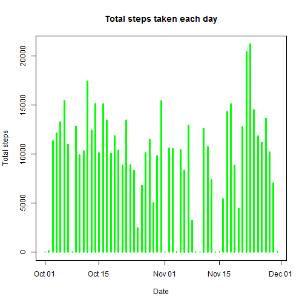
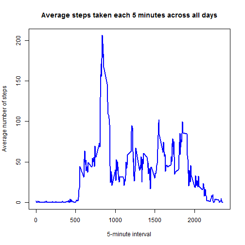
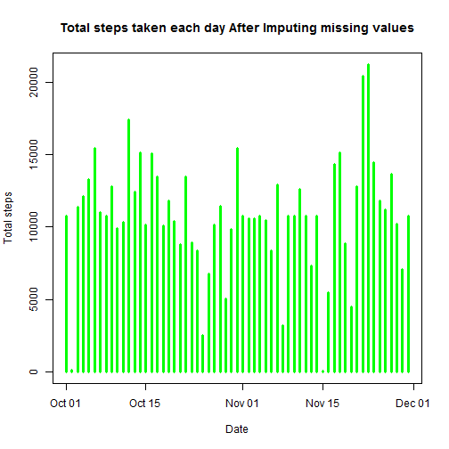
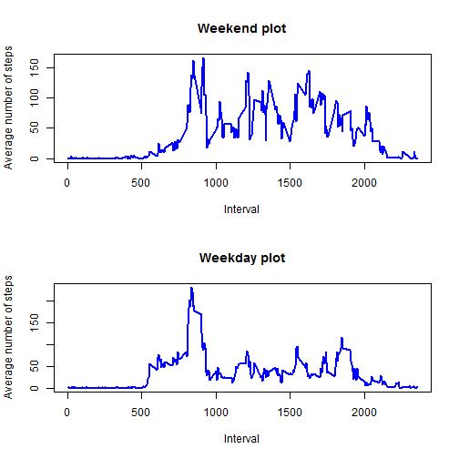

# Reproducible Research: Peer Assessment 1


## Loading and preprocessing the data
After setting the working directory, we execute the following code to load the dataset **activities** 

```r
activities <- read.csv(unz("activity.zip", "activity.csv"))
```


Let's take a look at **activities** dataset.

```r
str(activities)
```

```
## 'data.frame':	17568 obs. of  3 variables:
##  $ steps   : int  NA NA NA NA NA NA NA NA NA NA ...
##  $ date    : Factor w/ 61 levels "2012-10-01","2012-10-02",..: 1 1 1 1 1 1 1 1 1 1 ...
##  $ interval: int  0 5 10 15 20 25 30 35 40 45 ...
```


We notice that the type of **date** variable in the **activities** dataset is Factor.  
We change it to be Date type using the following code.

```r
activities <- transform(activities, date = as.Date(date, "%Y-%m-%d"))
```


## What is mean total number of steps taken per day?

### Making a histogram of the total number of steps taken each day
In order to do that we first calculate the steps per day applying this code.

```r
StepsPerDay <- aggregate(activities["steps"], by = activities["date"], FUN = sum, 
    na.rm = TRUE)
```


Then we plot a histogram that shows the total steps taken on a daily basis

```r
plot(StepsPerDay$date, StepsPerDay$steps, type = "h", lwd = 3, col = "green", 
    xlab = "Date", ylab = "Total steps", main = "Total steps taken each day")
```

 


### Calculating and reporting the mean and median total number of steps taken per day


```r
Mean <- mean(StepsPerDay$steps, na.rm = TRUE)
sprintf("Mean = %.2f", Mean)
```

```
## [1] "Mean = 9354.23"
```

```r
Median <- median(StepsPerDay$steps, na.rm = TRUE)
sprintf("Median = %.2f", Median)
```

```
## [1] "Median = 10395.00"
```


## What is the average daily activity pattern?

### Making a time series plot of the 5-minute interval (x-axis) and the average number of steps taken, averaged across all days (y-axis)

In order to do that we first calculate the average number of steps per interval applying this code.

```r
StepsPerInterval <- aggregate(activities["steps"], by = activities["interval"], 
    FUN = mean, na.rm = TRUE)
```


Then we plot a time series plot that shows the average number of steps taken on 5-minute interval averaged across all days.

```r
plot(StepsPerInterval$interval, StepsPerInterval$steps, type = "l", lwd = 2, 
    col = "blue", xlab = "5-minute interval", ylab = "Average number of steps", 
    main = "Average steps taken each 5 minutes across all days")
```

 


### Finding Which 5-minute interval, on average across all the days in the dataset, contains the maximum number of steps.


```r
maximum <- StepsPerInterval[which.max(StepsPerInterval$steps), "interval"]
```

The 5-minute interval contains the maximum number of steps is = 835


## Imputing missing values

### Calculating and reporting the total number of missing values in the dataset 


```r
TotalNAs <- sum(is.na(activities$steps))
```

Total number of missing values in the dataset is = 2304

### Devising a strategy for filling in all of the missing values in the dataset. 
We used the following strategy.  
Whenever there is a missing value we use the mean for that 5-minute interval 
correspond to that value instead of the NA.  

### Creating a new dataset that is equal to the original dataset but with the missing data filled in.

We made a new dataset **activities2** to store the filled NA dataset, and apply the previous strategy.


```r
activities2 <- activities
for (i in 1:nrow(activities2)) if (is.na(activities2$steps[i])) activities2$steps[i] <- subset(StepsPerInterval, 
    interval == activities2$interval[i])$steps
```


After executing the previous code we may check that **activities2** doesn't have any NA values.


```r
sum(is.na(activities2$steps))
```

```
## [1] 0
```


### Making a histogram of the total number of steps taken each day 


```r
StepsPerDay2 <- aggregate(activities2["steps"], by = activities2["date"], FUN = sum, 
    na.rm = TRUE)
plot(StepsPerDay2$date, StepsPerDay2$steps, type = "h", lwd = 3, col = "green", 
    xlab = "Date", ylab = "Total steps", main = "Total steps taken each day After Imputing missing values")
```

 


### Calculating and report the mean and median total number of steps taken per day. 


```r
Mean2 <- mean(StepsPerDay2$steps, na.rm = TRUE)
sprintf("Mean = %.2f", Mean2)
```

```
## [1] "Mean = 10766.19"
```

```r
Median2 <- median(StepsPerDay2$steps, na.rm = TRUE)
sprintf("Median = %.2f", Median2)
```

```
## [1] "Median = 10766.19"
```


### Do these values differ from the estimates from the first part of the assignment?
Yes in fact, the mean and median values differ from the estimates from the first part of the assignment.  

### What is the impact of imputing missing data on the estimates of the total daily number of steps?
After Imputing missing values stage, we notice that both the mean and the median number did increase.  
The mean increased from 9354.2295 to 10766.  
The median increased from 10395 to 10766.  


## Are there differences in activity patterns between weekdays and weekends?


### Creating a new factor variable in the dataset with two levels- "weekday" and "weekend" indicating whether a given date is a weekday or weekend day.

First, we define a function **f** that determine whether a given date is a weekday or a weekend day.

```r
f <- function(d) {
    if (weekdays(d) == "Saturday" || weekdays(d) == "Sunday") 
        "weekend" else "weekday"
}
```


Then we apply this function **f** to create a factor variable in the dataset.


```r
activities3 <- activities2
activities3$day <- as.factor(sapply(activities3$date, f))
```


Let us see a table to compare the number of weekdays and weekend days.

```r
table(activities3$day)
```

```
## 
## weekday weekend 
##   12960    4608
```


### Making a panel plot containing a time series plot of the 5-minute interval (x-axis) and the average number of steps taken, averaged across all weekday days or weekend days (y-axis).


```r
par(mfrow = c(2, 1))

with(subset(activities3, day == "weekend"), {
    StepsPerInterval <- aggregate(steps ~ interval, FUN = mean)
    plot(StepsPerInterval$interval, StepsPerInterval$steps, type = "l", lwd = 2, 
        col = "blue", xlab = "Interval", ylab = "Average number of steps", main = "Weekend plot")
})


with(subset(activities3, day == "weekday"), {
    StepsPerInterval <- aggregate(steps ~ interval, FUN = mean)
    plot(StepsPerInterval$interval, StepsPerInterval$steps, type = "l", lwd = 2, 
        col = "blue", xlab = "Interval", ylab = "Average number of steps", main = "Weekday plot")
})
```

 

